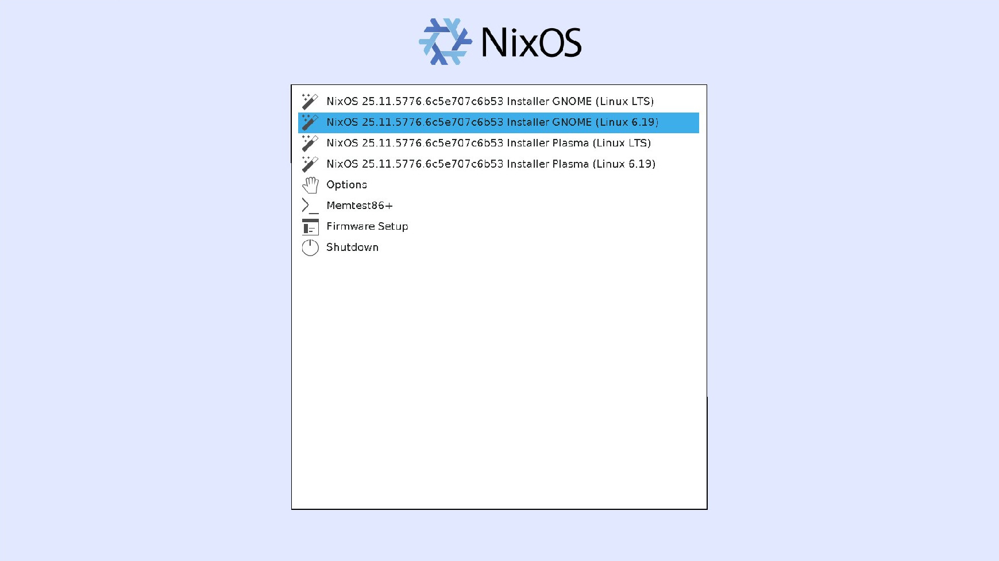
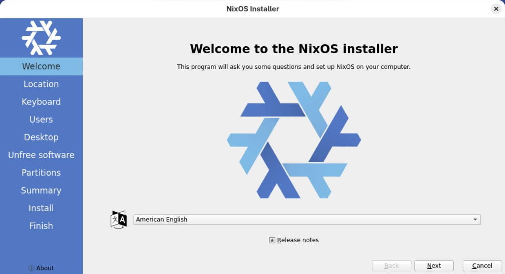
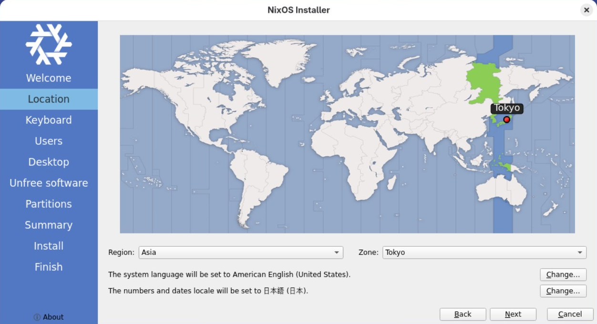
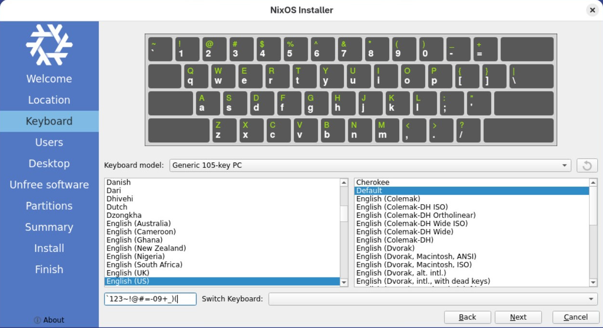
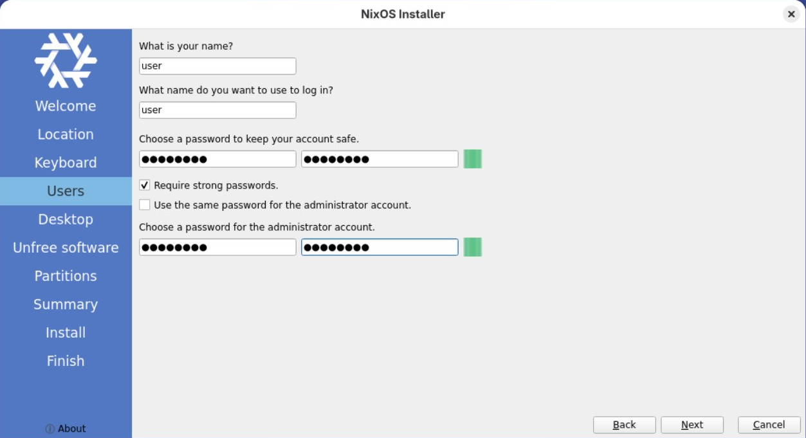
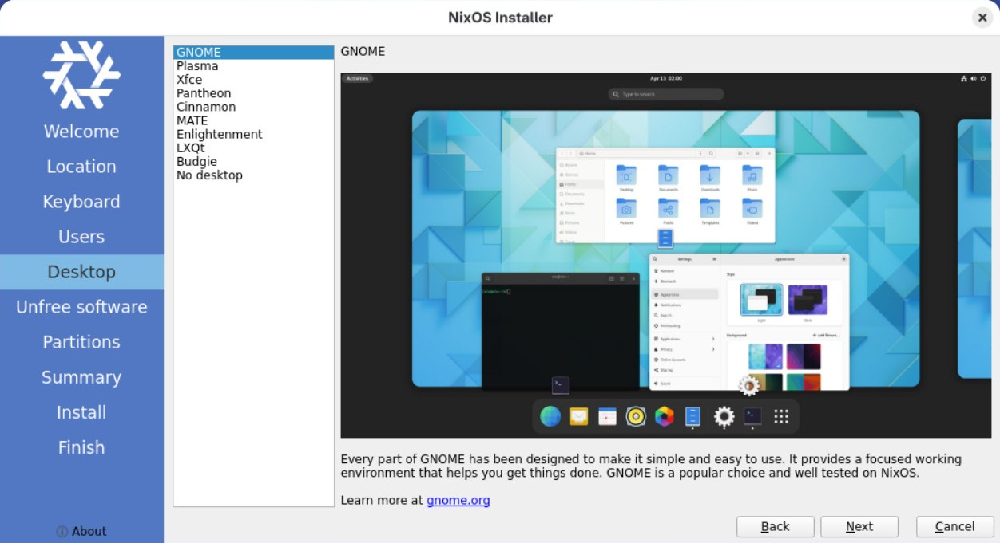
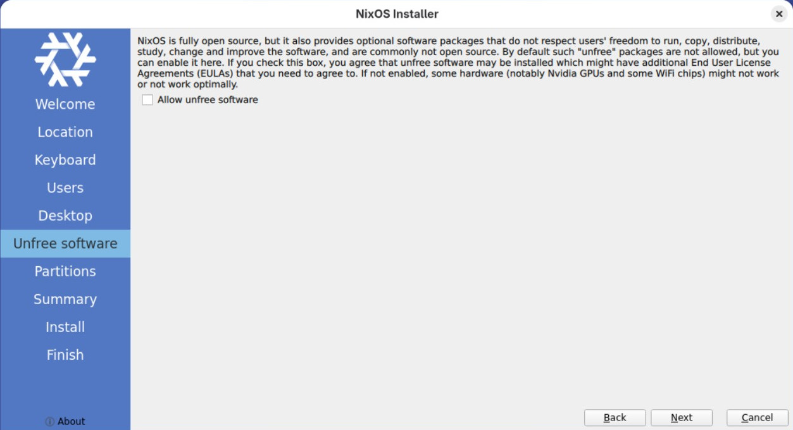
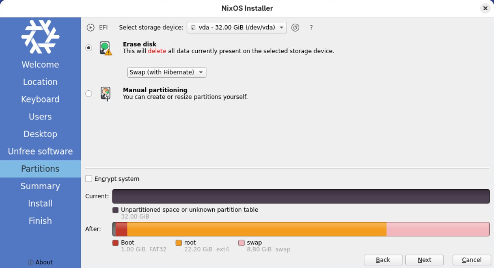
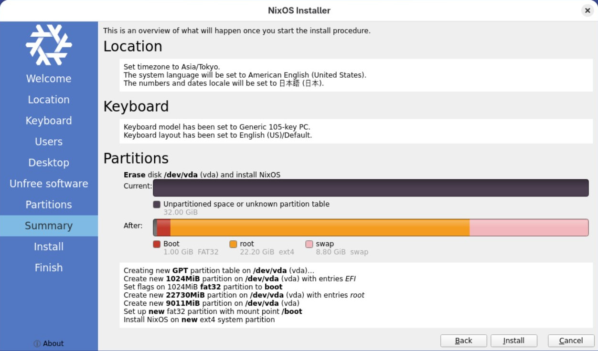
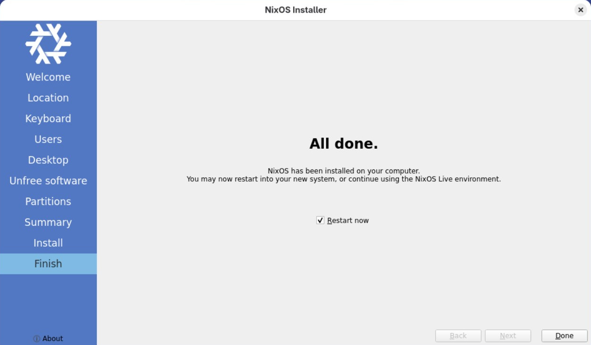

# インストール

1. ブートローダー
    + **... (Linux 6.19)** または **... (Linux LTS)**
    
2. ウェルカム
    + **American English**
    
3. ロケーション
    + Region: **Asia**
    + Zone: **Tokyo**
    
4. キーボード
    + **English (US)**
    + **Default**
    使用しているキーボードを選択する。
    
5. ユーザー
    ご自由に。
    
6. デスクトップ
    ご自由に。
    
7. 非フリーソフトウェア
    + Allow unfree software: **チェック無し**
    インストール後に **システム全体で許可** もしくは **個別に許可** が出来る。　
    
8. パーティション
    + Erase disk: **チェック**
    + **Swap (with Hibernate)**
    
9. インストール概要
    
10. インストール終了
    + Restart now: **チェック**
    